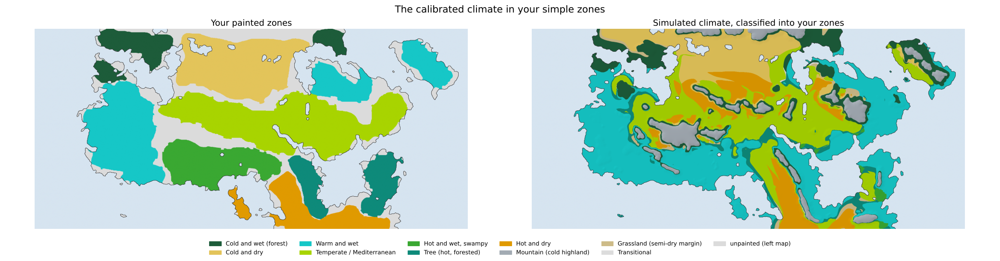
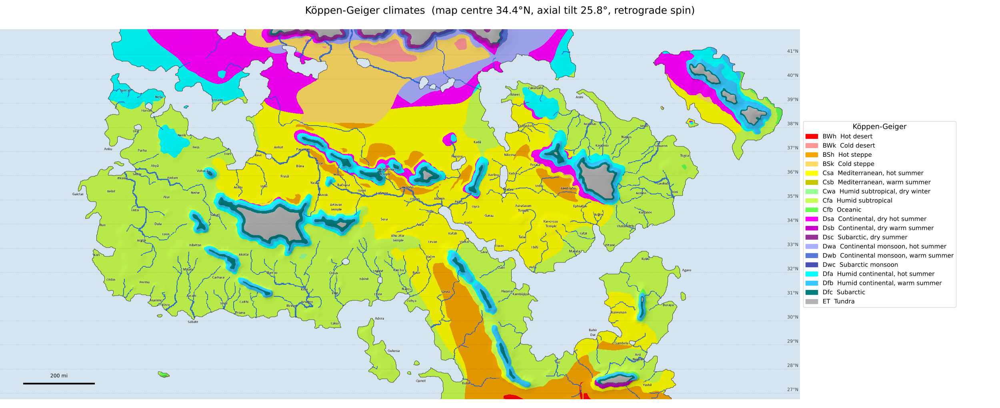
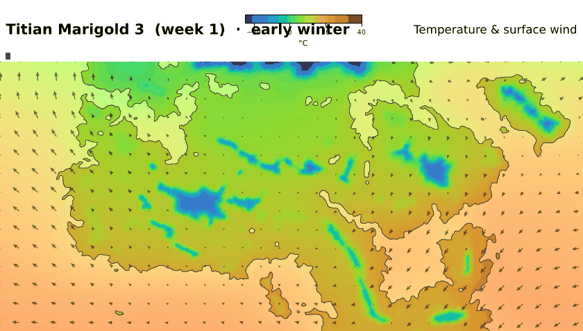

# rotclimate: a climate simulator for a hand-drawn world

A physically based seasonal climate model for a 2294 × 1062 mile hand-drawn
map (pointy-top hexes with 15-mile sides). The model reads the map's layers (coast, height tiers, rivers, place
names) and runs a year of weather in 73 five-day weeks on the local calendar.
A calibrator then searches for what the map doesn't say — latitude, axial
tilt, spin direction, how high the tiers are, and what lies beyond the edges —
until the simulated climate reproduces the painted target zones.

## Results

**Interactive atlas:** https://claude.ai/artifact/BMvofWDzswrdCgSBkHnNRf (private until you share it).
Zoomable map layers (Köppen, your zones, the simulated climate in your zones, match accuracy,
temperatures, precipitation). Click any place for its climograph in the local calendar and its
closest real cities. Search a town on the map, or a real city to see outlined where on the map
feels like it (the magnifier button shows or hides the search box). The copy button puts the
current view (zoom, outlines, names and all) on the clipboard as an image. Your settlement markers
(`data/source/settlements.png`, lossless) are drawn as vector pixel art, every pixel an exact square,
so they stay sharp at any zoom; the "Towns and names" toggle shows them with the place names.

In the simple-zones map, land that fits none of your seven zones is named for what it is:
*Mountain* (cold highland: above ~2,200 m or summers below 15 °C), *Grassland* (a semi-dry margin
between the wet and dry zones) or *Transitional* (humid, but between two zones' rules).





### What the world must be like (best calibration, round 13)

| unknown | best fit |
|---|---|
| spin | **retrograde (opposite to Earth)** |
| latitude | 27.6°N to 42.9°N (centre 35.2°N) |
| axial tilt | 25.5° (Earth 23.4°) |
| height tiers | lowland ≤ 105 m, hills ≤ 571 m, upland ≤ 2339 m, peaks to 5179 m |
| land beyond the map | north-west 61%, north-east 90%, west 44%, east 22%, south-west 88%, south-east ~100% |

The strongest result is the spin. With Earth-like spin, no calibration in any round could make
the south-east hot and dry. A final fairness run with identical physics and budget confirms it:
best balanced score 0.336 for Earth-like spin against 0.493 for retrograde, with hot-and-dry at 0.09. Reversed spin turns the continent into a mirror-image North America:
the west coast and south coast play the humid south-east US, the east plays California, the
south-east plays the dry south-west, and the north-west plays New England. (A southern-hemisphere
map with south at the top would behave the same way.)

### Match with the painted zones (14 km render, round 13)

Each zone is judged two ways. **Coverage**: how well the painted area meets the zone's climate
rule (0–1). **Precision**: how much of the rule's area lies inside its own painted zone, rather
than spilling into areas painted as something else (ridges above 1,500 m don't count as spill;
a broader zone may hold inside a narrower one it contains, as forest inside swamp). **F1**
balances the two. *Correct* is the share of painted land whose single best-fitting zone is its own
(a place meeting the swamp rule counts as swamp).

The swamp rule asks for a hot, very wet climate **on flat ground**: your painted swamp gets the
same rain as the warm-wet coast but is about five times flatter (median slope 0.7 vs 3.4 ‰),
and waterlogged lowland is what makes a swamp (Everglades, Pantanal, Gulf Coast bayous).

| zone | coverage | precision | F1 | correct |
|---|---|---|---|---|
| Cold and wet | 0.44 | 0.28 | 0.35 | 67% |
| Cold and dry | 0.58 | 0.67 | 0.62 | 82% |
| Warm and wet | 0.50 | 0.51 | 0.50 | 33% |
| Mediterranean | 0.38 | 0.58 | 0.46 | 45% |
| Hot and wet, swampy | 0.31 | 0.26 | 0.28 | 33% |
| Tree (forested) | 0.74 | 0.34 | 0.46 | 58% |
| Hot and dry | 0.43 | 0.35 | 0.39 | 57% |
| **overall** | **0.48** | | **0.41** (objective) | **51%** |

(it00, the Earth-like first guess: coverage 0.17 and 9% correct.)

Where it still falls short:
* **The swamp** now shows up on the painted south coast (it was never the best fit before round
  13), but the same hot, wet, flat climate also covers the flat southern end of the warm-wet west
  coast, so its precision stays low.
* **Hot-and-dry** spills into the northern edge of the Mediterranean band, and cold-and-wet
  into hills and the north-east.

The maps are simulated on 14 km cells, the same grid rounds 11–13 were calibrated on. Since the
time-step fix (see `docs/ITERATIONS.md`), the calibration's 25 steps a year and the maps' 73 give
the same climate. All map layers are drawn at 3× resolution with full-detail terrain.

### Maps and GIFs (`output/`)

`simulated_zones.png` · `koppen.png` · `comparison.png` · `world_context.png` · `temperature_*.png` ·
`precipitation_annual.png` · `atlas_temperature.png` · `atlas_precipitation.png` ·
`climographs.png` (with "feels like" cities) · `insolation.png` · `year_temperature.gif` ·
`year_precipitation.gif` · `spin_flip.gif` · `tilt_sweep.gif` · `surroundings.gif` · `improvement.gif`



**Real-world analogues ("feels like").** The reference set is every city of 50,000+ people and
every national capital (GeoNames; suburbs within 15 km folded into the bigger city): 8,468
cities. Each has monthly normals from WorldClim 2.1 (1970–2000), corrected to the city's own
elevation. Another 472 official WMO weather stations cover remote places no city does
(mountains, islands, polar and desert outposts). Checked against the official WMO station
normals for 1,262 cities with a station within 10 km, the monthly temperatures differ by a median
of 0.54 °C (90% under 1.24 °C) and annual rainfall agrees to within ±20% for 80% of them.

Both the map place and each real place are reduced to 12 months aligned on the winter solstice
(southern-hemisphere places shift half a year). Then

    d = RMS(monthly temperature difference) / 2.5 °C + RMS(difference of √monthly rain) / 2
    match % = 100 · e^(−d/2)

so 100% is identical, and every 2.5 °C off in a typical month (or rain off by 2 √mm, e.g. 100 vs
144 mm) multiplies it by 0.61. The temperature term compares **daily highs and lows**, not just
means: RMS(ΔT)² = mean over months of (Δhigh² + Δlow²)/2 = Δmean² + Δswing²/4, so a day/night swing
4 °C wider counts like a month 2 °C warmer.

**Day/night swings.** The climate model works in daily means, so the map's day/night range is
learned from Earth: WorldClim monthly mean daily highs minus lows at 100,000 land cells, as a
function of what the model does compute (monthly and annual rain, monthly temperature and its
seasonal departure, annual temperature range, elevation, distance from the sea, latitude), by
nearest-neighbour regression (`rotclimate/diurnal.py`). Tested on whole continents it never saw,
it explains about half the variation, with a typical error of 1.8 °C in the range (about ±0.9 °C on
highs and lows): deserts and continental interiors swing 14–18 °C, rainy coasts 5–8 °C. The real
places' highs and lows come from WorldClim (cities) and the WMO normals (stations), which agree to a
median of 0.0 °C. In the atlas the climograph's band is the average daily low to high. The square root makes 10 vs 40 mm count about as much as 100 vs
160 mm. A result list never shows two places within 100 km of each other, and each match shows
its typical monthly temperature and rain difference in plain units.
Place names come from your hex-grid list (`data/hex-names.csv`), placed by `scripts/hex_places.py`.

## Quick start

```bash
pip install -r requirements.txt
scripts/make_all.sh calibration/best_params.json          # every map, GIF, chart + atlas data
python -m rotclimate render --params calibration/best_params.json --out output
python -m rotclimate score  --params calibration/best_params.json
python -m rotclimate calibrate --physics v4 --objective balanced --seeds 1,2 \
       --start calibration/best_params.json --out calibration/my_run --evals 600
python -m rotclimate.experiments tilt --params calibration/best_params.json --out output/tilt_sweep.gif
python scripts/fetch_wmo_normals.py      # official WMO station normals (needs worldweather.wmo.int)
python -I scripts/build_reference.py .   # city reference set; first download into data/cache/:
python -I scripts/build_dtr_model.py .   # day/night range model (data/dtr_knn.npz)
#   geonames/  cities15000.zip, admin1CodesASCII.txt, countryInfo.txt  (download.geonames.org/export/dump/)
#   worldclim/ wc2.1_5m_{tavg,tmin,tmax,prec,elev}.zip                   (geodata.ucdavis.edu/climate/worldclim/2_1/base/)
python -m pytest -q                      # fast checks (calendar, Köppen, solver, hydrology, end-to-end)
```

To view the interactive atlas locally, run `python -m http.server -d atlas` and open
http://localhost:8000.

A full-resolution render (7 km cells, 73 weeks) takes a few minutes on 4 cores.
The 28 km grid used for calibration simulates a year in about 1 s.

## Repository layout

| path | what |
|---|---|
| `data/source/` | your five map layers (elevation, rivers, target climate, roads, labels) |
| `data/places.csv` | place names with their pixel positions (transcribed from the labels layer) |
| `data/real_cities_worldclim.csv` | 8,468 real cities with monthly normals, the "feels like" reference (`scripts/build_reference.py`) |
| `data/dtr_knn.npz` | Earth-trained day/night range model (`scripts/build_dtr_model.py`) |
| `data/real_cities_wmo.csv` | official WMO station normals: remote reference places and the cross-check (`scripts/fetch_wmo_normals.py`) |
| `rotclimate/geography.py` | layers → model grid, tier elevations, target masks, procedural surroundings |
| `rotclimate/astronomy.py`, `ebm.py` | sunlight for any tilt; planet-wide seasonal energy balance |
| `rotclimate/model.py`, `solver.py` | the 2-D seasonal model (winds, temperature, moisture, rain, snow) |
| `rotclimate/koppen.py`, `score.py` | Köppen–Geiger classes; fuzzy scoring against the painted zones; river check |
| `rotclimate/analogs.py` | real-world "feels like" matching on solstice-aligned seasons |
| `rotclimate/hydrology.py` | runoff, priority-flood drainage, river discharge (validated against your drawn rivers) |
| `tests/` | fast automated checks |
| `rotclimate/calibrate.py` | CMA-ES search over ~45 unknowns |
| `rotclimate/render.py`, `experiments.py`, `atlas.py` | maps, GIFs, climographs, sweeps, atlas data |
| `atlas/index.html` | the interactive atlas page |
| `calibration/` | best parameters, every round's best, iteration snapshots |
| `docs/MODEL.md` | how the physics works |
| `docs/ITERATIONS.md` | the improvement log |
| `output/` | rendered maps and GIFs |
